# Repo System Audit

This is a code-driven map of how AlphaBook fits together as of 2026-04-07.

It focuses on:

- what runs where
- what talks to what
- where state lives
- what the source of truth is for each kind of data
- the lifecycle of sessions, runs, long-running jobs, runtime workspaces, and ingest/embedding work

The fastest way to read this is:

1. start with the deployment map
2. read the storage/source-of-truth table
3. read the chat run lifecycle
4. read the ingest and embedding lifecycle

## 1. Monorepo Shape

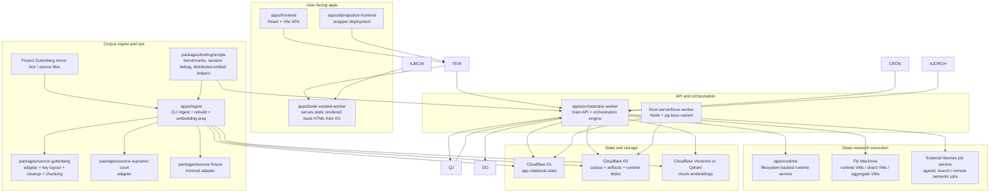

## 2. Deployed Topology

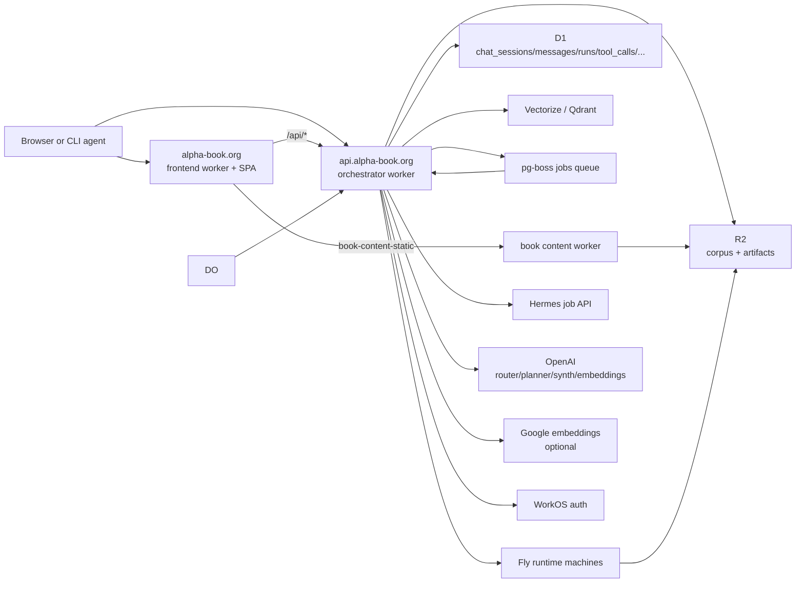

## 3. Core Components and Responsibilities

- `apps/orchestrator-worker`
  The center of gravity. It owns HTTP routes, auth, session/run state, planner loop, tool execution, queue consumption, cron cleanup, runtime coordination, Hermes integration, notifications, analytics, and billing events.
- `apps/runtime`
  The deep-research execution environment. It hydrates a workspace from R2 into a real filesystem under `/workspace`, runs agent/code tasks, writes progress and outputs to files, and exposes them back to the orchestrator over HTTP.
- `apps/frontend`
  The shared AlphaBook/AlphaJustice React app. The browser mostly talks to `/sessions`, `/chat`, `/runs`, `/me`, admin/debug endpoints, and book APIs through the frontend worker proxy.
- `apps/book-content-worker`
  A separate Worker that serves pre-rendered book landing pages, manifests, and per-page HTML directly from R2.
- `apps/ingest`
  CLI/operator path for corpus import, cleanup, chunking, rendered page generation, embedding generation, vector upserts, rebuilds, and integrity audits.
- `packages/source-gutenberg`
  Defines the Gutenberg adapter: text cleanup, chunking, key layout, workspace schema, and Gutenberg-specific ranking/query hooks.
- `packages/db`
  D1/Postgres client helpers and base D1 schema.
- `packages/corpus-core`, `packages/platform`, `packages/shared`, `packages/implementations`
  Shared contracts, artifact keys, prompt wiring, implementation config, compatibility layers, and neutral document APIs.

## 4. Storage and Source of Truth

### High-level rule

- D1 is the source of truth for application state.
- R2 is the source of truth for large blobs and corpus artifacts.
- Vectorize/Qdrant is the source of truth for embedding vectors.
- Runtime local filesystem is the source of truth only while a runtime job is alive.

### Storage map

| Data | Primary source of truth | Where defined/used | Notes |
| --- | --- | --- | --- |
| users, sessions, messages | D1 | `packages/db/src/d1-sql.ts` | `users`, `chat_sessions`, `messages` |
| runs, tool calls, run events | D1 | `packages/db/src/d1-sql.ts` | Core execution history |
| runtime instances | D1 + R2 | `runtime_instances`, `artifacts` | D1 stores metadata; manifests/catalogs may spill to R2 |
| assistant artifacts, debug blobs, streamed raw logs | D1 + R2 | `artifacts`, `run_events` | Small payloads inline in D1, heavy payloads spilled to R2 |
| background job metadata | D1 | `background_jobs` | Created lazily in `apps/orchestrator-worker/src/d1-store.ts` |
| durable research task metadata | D1 | `research_tasks` | Also created lazily in `apps/orchestrator-worker/src/d1-store.ts` |
| works/authors/subjects/feed rows | D1 | `works`, `authors`, `subjects`, `feed_works` | Search/discovery metadata |
| work file locations | D1 | `work_files` | Maps logical file kinds to R2 keys |
| raw corpus text | R2 | `gutenberg/raw/...` | Raw mirror output, not stored inline in D1 |
| clean text | R2 | `gutenberg/clean/.../clean.txt` | Referenced from `work_files` |
| chunk manifests / per-chunk JSON | R2 | `gutenberg/clean/.../chunks.jsonl` and `chunks/*.json` | Retrieval reads manifests from R2 |
| rendered book HTML | R2 | `gutenberg/clean/.../book.html`, `book/manifest.json`, `book/pages/*.html` | Served by content worker |
| embeddings | Vectorize or Qdrant | vector index only | D1 does not store full vectors |
| runtime workspace files | runtime filesystem | `/workspace/...` inside runtime VM | Persisted selectively back to R2 as artifacts |

### Corpus R2 key layout

For Gutenberg, the canonical keys come from `packages/source-gutenberg/src/storage.ts`.

```text
gutenberg/raw/<id>/raw.txt
gutenberg/raw/<id>/metadata.json
gutenberg/raw/<id>/cover.<ext>

gutenberg/clean/<id>/clean.txt
gutenberg/clean/<id>/chunks.jsonl
gutenberg/clean/<id>/chunks/000000.json
gutenberg/clean/<id>/book.html
gutenberg/clean/<id>/book/manifest.json
gutenberg/clean/<id>/book/pages/page-0001.html
```

### Run/runtime artifact R2 key layout

From `packages/corpus-core/src/artifacts.ts`:

```text
artifacts/sessions/<sessionId>/<filename>
artifacts/runtimes/<runtimeId>/<filename>
```

Common examples:

```text
artifacts/sessions/<session>/runs/<run>/events/000001.json
artifacts/sessions/<session>/runs/<run>/hermes/...
artifacts/runtimes/<runtime>/manifest.json
artifacts/runtimes/<runtime>/workspace/file-catalog.json
```

## 5. D1 Schema: What the App Actually Tracks

Base schema in `packages/db/src/d1-sql.ts`:

- `users`
- `chat_sessions`
- `messages`
- `runs`
- `tool_calls`
- `run_events`
- `authors`
- `works`
- `work_authors`
- `subjects`
- `work_subjects`
- `work_files`
- `runtime_instances`
- `artifacts`
- `jobs`
- `notifications`
- `user_follows`
- `billing_events`
- `analytics_events`
- `agent_identities`
- `feed_works`
- `site_stats`

Additional tables created lazily by the orchestrator D1 store:

- `research_tasks`
  Queueable long-running tool executions, especially `semantic_deep_search` and `run_workspace_task`.
- `background_jobs`
  External background systems, especially Hermes jobs.

Important implication:

- D1 has the run graph and corpus metadata.
- D1 does not store chunk text as normalized rows.
- Chunk text is loaded from R2 chunk manifests when needed.
- Embeddings are not stored in D1.

## 6. Chat / Session / Run Lifecycle

### What a session is

- A session is a persistent thread in `chat_sessions`.
- Messages live in `messages`.
- One session can have many runs in `runs`.
- A run is one execution attempt against the current thread state.

### Request path

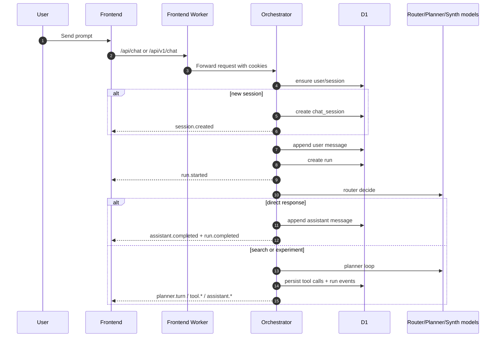

### What gets persisted during a run

- the user message
- the run row
- planner turns count
- each tool call with args/result
- chronological run events
- final assistant message
- optional artifacts and research-document HTML
- billing, analytics, notifications, runtime instance rows

### Run execution modes

There are really four major outcomes:

1. `direct_response`
   Router answers immediately with no retrieval/planning loop.
2. `semantic`
   Normal retrieval-first orchestrator loop.
3. `comprehensive`
   Sprite fanout mode across many runtime shards.
4. `agentic`
   Hermes-backed remote job path.

## 7. Standard Search Lifecycle

This is the non-Hermes planner loop in `apps/orchestrator-worker/src/app.ts`.

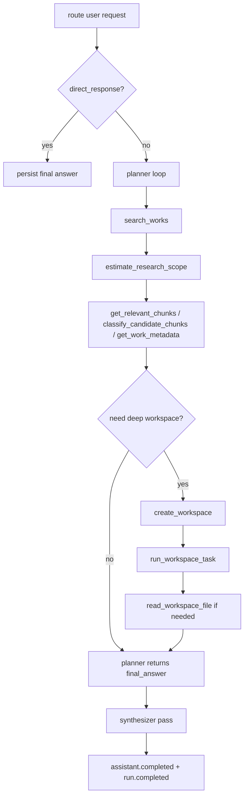

### Tool categories

- fast metadata/retrieval tools
  - `search_works`
  - `estimate_research_scope`
  - `get_work_metadata`
  - `get_relevant_chunks`
  - `classify_candidate_chunks`
  - `get_work_text`
- runtime-backed tools
  - `create_workspace`
  - `run_workspace_task`
  - `read_workspace_file`
  - `destroy_workspace`
- remote long-running tools
  - `semantic_deep_search`
  - `run_workspace_task` when queued as a durable research task

## 8. Long-Running Job Lifecycles

### A. Durable research task lifecycle

Used for long tool executions that should survive queueing, retries, or worker lease loss.

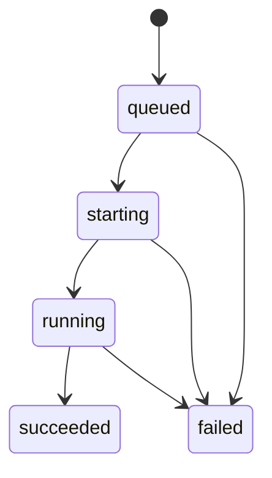

Tracked in `research_tasks` with:

- `run_id`
- `session_id`
- `tool_call_id`
- `runtime_id`
- `kind`
- `task_spec_json`
- `checkpoint_json`
- `progress_seq`
- `last_heartbeat_at`
- `lease_owner`
- `lease_expires_at`
- `result_artifact_key`
- `error_json`

The orchestrator can re-enqueue a queued task if its lease expires.

### B. Hermes background job lifecycle

Agentic search is not the standard planner loop. It launches an external job and mirrors it back into AlphaBook state.

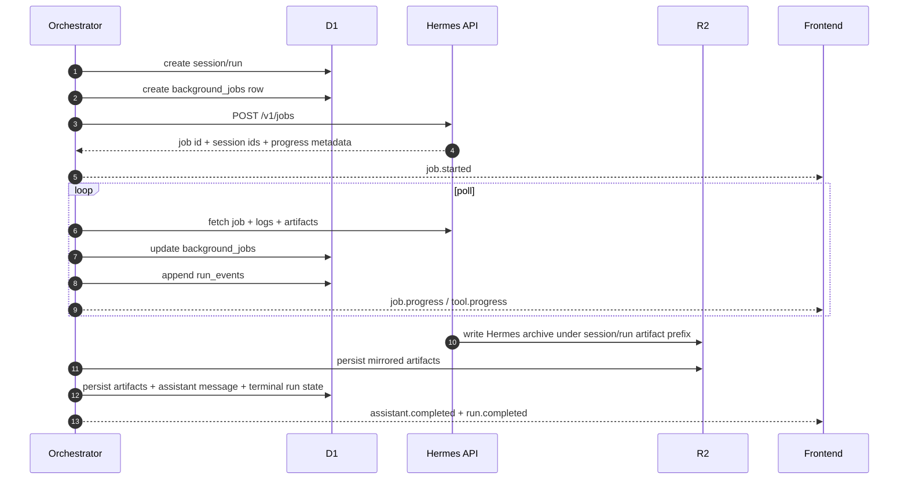

Hermes produces external artifacts like:

- `briefing.md`
- `hits/index.json`
- `hermes.session.json`
- archive manifests and logs

AlphaBook then copies or references those into its own artifact model.

### C. Sprite fanout lifecycle

Comprehensive mode fans work across many Fly runtime machines.

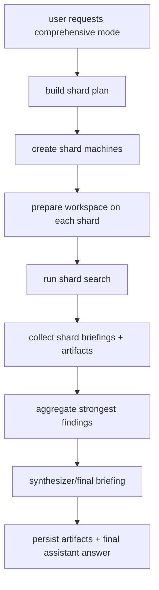

Sprite state is reflected in:

- runtime machine metadata on Fly
- `runtime_instances`
- run events
- runtime artifacts in R2
- final synthesized output in the session

## 9. Runtime Workspace Lifecycle

Deep research uses the runtime service in `apps/runtime`.

### What the runtime gets

- a `runtimeId`
- a `sessionId`
- selected works/chunks
- workspace manifest
- download list of R2 objects
- task context / task spec

### Runtime filesystem shape

Inside a runtime machine, the workspace root becomes:

```text
/workspace/books
/workspace/chunks
/workspace/context
/workspace/output
/workspace/scratch
```

### Runtime lifecycle

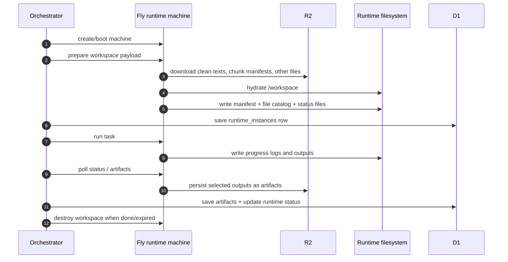

### Runtime-local state

These files are runtime-local first, and only some are later mirrored to R2:

- `output/run-status.json`
- `output/openai-usage.jsonl`
- `output/codex-progress.jsonl`
- generated notes, briefs, summaries, or intermediate files

Important distinction:

- while running, the freshest state is often on the runtime filesystem
- after persistence, AlphaBook exposes it via `artifacts`, `runtime_instances`, `liveRuntime`, and debug/log endpoints

## 10. Where Run Logs Actually Live

The answer is split:

- lightweight chronology: D1 `run_events`
- tool rows: D1 `tool_calls`
- message transcript: D1 `messages`
- heavy debug payloads and artifacts: R2
- live runtime snapshots: runtime filesystem, surfaced via debug endpoints

So the source of truth for "run logs" is not a single thing.

Use this mental model:

- D1 tells you what happened and in what order.
- R2 holds the large bodies, manifests, raw tool payloads, and saved files.
- runtime FS shows what is happening right now if the machine is still alive.

## 11. Retrieval and Semantic Search

### Important nuance

There is no normalized `chunks` table in the base D1 schema.

Instead:

- D1 stores `works` and `work_files`
- `work_files.kind='chunks'` points to the chunk manifest in R2
- the orchestrator D1 store loads chunk manifests from R2
- lexical chunk matching happens against those R2-backed chunk manifests
- vector similarity happens against Vectorize/Qdrant

### Retrieval stack

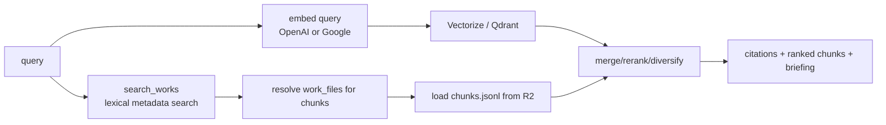

Backends:

- default semantic path: local orchestrator flow with embedder + vector index + R2 chunk manifests
- `semantic_deep_search`: long-running semantic search path
- optional backend selector: `alphaloop` or `context1`
- Hermes can also launch remote semantic-search jobs

## 12. Ingest and Embedding Lifecycle

### End-to-end ingest pipeline

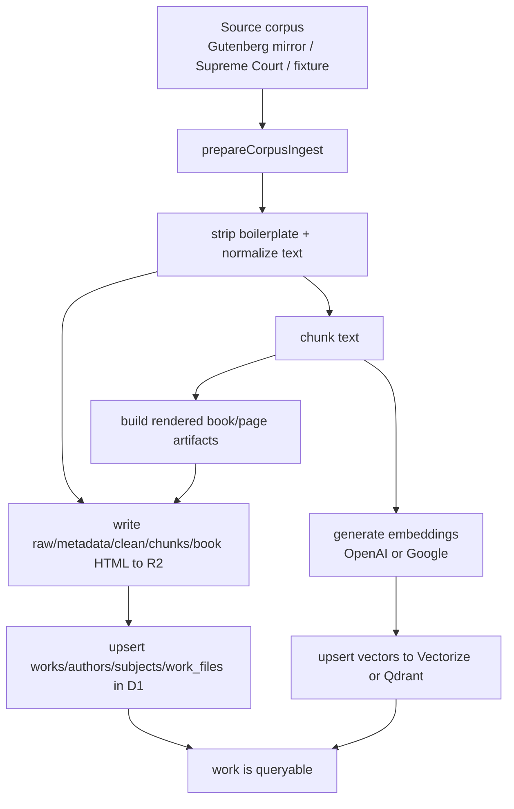

### What the ingest step writes

- to R2
  - raw text
  - metadata json
  - clean text
  - chunk manifest jsonl
  - per-chunk objects
  - rendered `book.html`
  - rendered book manifest and page HTML
- to D1
  - `works`
  - `authors`
  - `subjects`
  - `work_authors`
  - `work_subjects`
  - `work_files`
- to vector store
  - one vector per chunk, plus metadata

### Embedding runs

There are two embedding patterns:

1. inline ingest
   During normal ingest, chunks are embedded and then upserted.
2. batch/offline embedding
   The repo can prepare and submit large provider batch jobs, then download outputs and upsert vectors.

Primary commands from `apps/ingest/src/index.ts`:

```bash
npx tsx apps/ingest/src/index.ts ingest-gutenberg <gutenbergId> [title]
npx tsx apps/ingest/src/index.ts ingest-fixture [documentId|-]
npx tsx apps/ingest/src/index.ts ingest-supreme-court-demo [caseId|-]

npx tsx apps/ingest/src/index.ts prepare-openai-embedding-batch ...
npx tsx apps/ingest/src/index.ts submit-openai-embedding-batch <manifestPath>
npx tsx apps/ingest/src/index.ts openai-embedding-batch-status <batchId|submissionPath>
npx tsx apps/ingest/src/index.ts download-openai-embedding-batch-output <submissionPath> [outputDir]

npx tsx apps/ingest/src/index.ts prepare-google-embedding-batch ...
npx tsx apps/ingest/src/index.ts submit-google-embedding-batch <manifestPath>
npx tsx apps/ingest/src/index.ts google-embedding-batch-status <batchJobName|submissionPath>
npx tsx apps/ingest/src/index.ts download-google-embedding-batch-output <submissionPath> [outputDir]
```

Vector destinations:

- Cloudflare Vectorize via `apps/ingest/src/vectorize-api.ts`
- Qdrant via `apps/ingest/src/qdrant-api.ts`

### Re-embedding / distributed helpers

The repo also has operator helpers in `packages/tooling/scripts`, especially:

- `reembed-distributed-shard.ts`
- `setup-distributed-run.ts`
- `provision-distributed-shard-machine.ts`
- sprite/distributed benchmark and provisioning scripts

## 13. Static Book HTML Lifecycle

Rendered books are not generated on request.

They are created during ingest or rebuild, stored in R2, and served by the content worker.

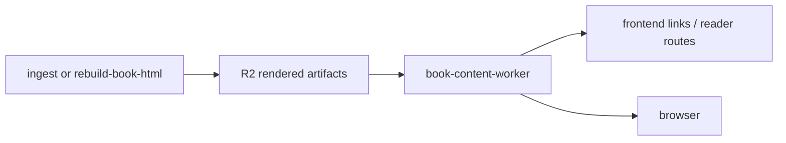

Important routes:

- landing page
  - `<content-origin>/<externalId>/`
- manifest
  - `<content-origin>/<externalId>/manifest.json`
- page HTML
  - `<content-origin>/<externalId>/pages/page-0001.html`
- passage redirect
  - `<content-origin>/<externalId>/passages/<passageId>`

## 14. Auth, Agent Keys, and Ownership

There are two auth modes:

1. browser/session auth via WorkOS cookies
2. headless agent auth via `agent_identities` API keys

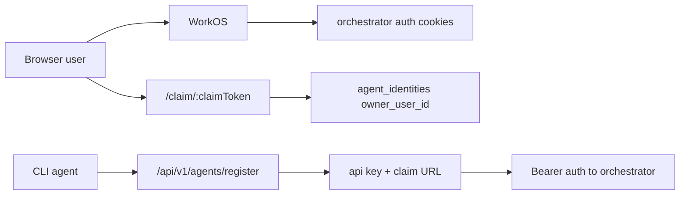

The agent identity gets a synthetic AlphaBook user row, so agent-owned sessions still plug into the same `chat_sessions` and `runs` model.

## 15. Cleanup / Janitor Flows

The orchestrator has a 1-minute cron and queue consumer.

Scheduled cleanup does at least:

- reap expired runtime instances
- reap stale runs
- finalize runs whose worker lease died

Queue processing does at least:

- consume `research_task_requested`
- claim or renew task leases
- execute queued long-running research work

## 16. Practical Mental Model

If you want the shortest accurate model of the system, it is this:

- AlphaBook is a sessioned chat app over a corpus.
- D1 tracks conversations, runs, tools, runtime metadata, notifications, analytics, and corpus metadata.
- R2 stores the real corpus files and large run artifacts.
- Vectorize/Qdrant stores chunk embeddings.
- The orchestrator does routing, planning, persistence, and coordination.
- The runtime does deep filesystem-backed work.
- Hermes is a separate remote job system used for agentic search.
- The content worker serves pre-rendered book pages from R2.
- Ingest is a separate CLI/operator path that turns raw corpus inputs into D1 metadata, R2 artifacts, and vectors.

## 17. "If I Need To Debug X, Where Do I Look?"

| Question | Start here |
| --- | --- |
| Why did a session fail? | `docs/session-debugging.md`, then `/admin/runs/:runId/logs` |
| Why is a run stuck? | `runs`, `run_events`, `tool_calls`, `research_tasks`, `background_jobs` |
| Why is deep research weird? | `runtime_instances`, runtime artifacts, runtime filesystem snapshots via debug endpoints |
| Why is book content missing? | `work_files`, R2 rendered keys, `book-content-worker` |
| Why are search results bad? | `works` metadata, chunk manifests in R2, vector index population, embed config |
| Why is a book not embedded? | ingest commands, batch manifests/output dirs, vector index state |
| Why is agentic search weird? | Hermes job record, Hermes logs, mirrored artifacts under session run prefix |

## 18. File-Level Anchor Map

- Main app surface: `apps/orchestrator-worker/src/app.ts`
- Linux queue orchestration: `apps/orchestrator-worker/src/linux-worker.ts`
- Shared queued research helpers: `apps/orchestrator-worker/src/queued-research.ts`
- Run/session/artifact/research-task state model: `apps/orchestrator-worker/src/store.ts`
- D1-backed implementation: `apps/orchestrator-worker/src/d1-store.ts`
- Runtime integration: `apps/orchestrator-worker/src/runtime.ts`
- Semantic search backends: `apps/orchestrator-worker/src/semantic-search.ts`
- Hermes integration: `apps/orchestrator-worker/src/hermes-job-client.ts`
- Runtime service: `apps/runtime/src/server.ts`
- Ingest CLI: `apps/ingest/src/index.ts`
- Generic ingest prep: `apps/ingest/src/corpus-ingest.ts`
- Gutenberg adapter: `packages/source-gutenberg/src/adapter.ts`
- Gutenberg key layout: `packages/source-gutenberg/src/storage.ts`
- Base D1 schema: `packages/db/src/d1-sql.ts`
- Frontend API surface: `apps/frontend/src/api.ts`
- Static content worker: `apps/book-content-worker/src/index.ts`

## 19. Biggest Architectural Truths

- The repo is not "frontend + backend". It is at least five systems: frontend shell, orchestrator, runtime, content worker, ingest pipeline.
- Corpus metadata and corpus content are intentionally split: metadata in D1, heavy text/artifacts in R2.
- Deep research is not just another API call. It is a distributed job orchestration problem with queues, leases, runtimes, and spillover storage.
- The chunk layer is surprisingly R2-centric. D1 points to chunk manifests; it does not normalize chunk rows.
- Hermes is effectively a second execution engine integrated into the same session/run model.
